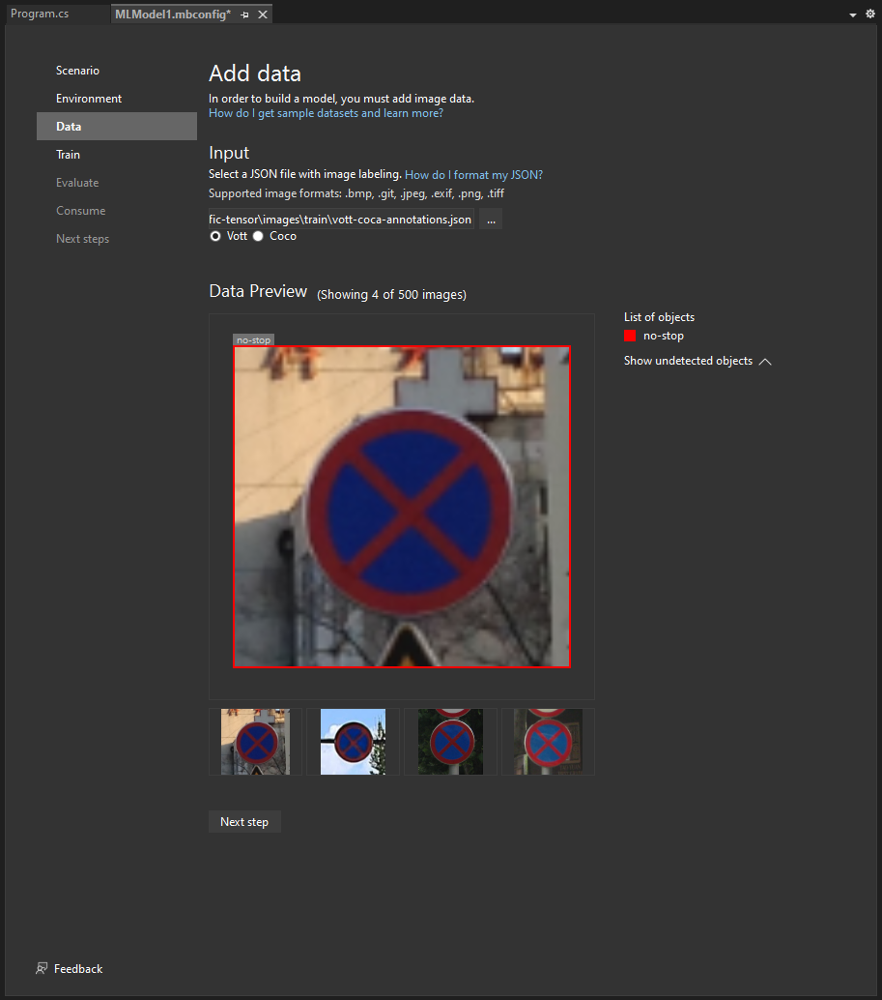

# Votter

Votter writes an annotation file in [VoTT format](https://github.com/microsoft/VoTT) (Visual Object Tagging Tool) for use with [ML.NET Model Builder](https://marketplace.visualstudio.com/items?itemName=MLNET.ModelBuilder2022). It takes a folder of images structured for training classification tasks and writes an `annotations.json` file, helpful as input for training. If you have a dataset of labeled images, Votter helps convert your folder structure into a VoTT file for use with Model Builder.

## Usage
```bash

   votter [path_to_images] [annotation.json]

```

## Options

    -v or --version
    -h or --help

## Arguments

    path_to_images (optional): The path to the directory containing subdirectories of images. If not provided, the current working directory is used.
    annotation.json (optional): The path to the annotation file to be generated. If not provided, the current working directory is used with the filename annotations.vott.

## Example
```bash

   votter     ./dataset ./annotations.json
   votter.exe C:\dataset\ C:\dataset\annotations.json
   go run votter.go ./dataset ./dataset/annotations.json

```

```bash

dataset/
    ├── cat/
    │   ├── image1.jpg
    │   └── image2.png
    └── dog/
        ├── image1.jpg
        └── image2.png
```


